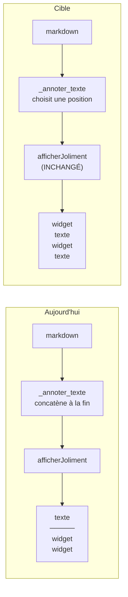

# Feuille de route — intégrer les widgets dans le corps du message

Étude de faisabilité + plan d'implémentation, rédigée le 24/08/2026.
**Rien de ce qui suit n'est implémenté** — c'est un document de décision.

Comme pour `HANDOFF.md` : ce qui est marqué « vérifié » a été exécuté, pas
supposé. Le reste est explicitement présenté comme une hypothèse.

---

## 1. Le besoin

Aujourd'hui, tous les widgets sont ajoutés **à la fin** de la réponse. Ils se
lisent comme un bonus détaché du message. Or :

- une **card** résume l'entité dont parle la réponse : sa place est **en tête**,
  avant le texte qui la détaille ;
- le futur widget **météo** est de la même famille : il répond à la question,
  il ne la commente pas — donc en tête également ;
- une **image** et sa légende ont leur place **là où le texte en parle**, pas
  reléguées après la conclusion ;
- plus généralement : le widget doit faire **partie du message**, pas s'y
  ajouter.

---

## 2. Verdict de faisabilité : **élevée, et bien plus simple qu'annoncé**

`HANDOFF.md` §10 présentait le placement intercalé comme une voie « non
implémentée, rien ne l'a démontré nécessaire ». C'est exact, mais le document
sous-estimait ce qui était déjà acquis.

**Le renderer sait déjà faire.** Aucune modification de `rendu/` n'est
nécessaire — ni `afficheur.py`, ni `registre.py`, ni le contrat de bloc.

Vérifié le 24/08/2026 en exécutant `afficherJoliment()` sur du texte contenant
un bloc widget placé ailleurs qu'à la fin :

| Texte fourni | Ordre obtenu dans le HTML |
|---|---|
| bloc `widget:card`, puis 2 paragraphes | card (pos. 180) → §1 (608) → §2 (650) ✅ |
| §1, bloc `widget:card`, §2 | §1 (3) → card (207) → §2 (615) ✅ |

C'est la conséquence directe de l'architecture existante : `_extraire_widgets()`
remplace chaque bloc par un **marqueur unique à sa position**, le Markdown est
parsé, puis `_injecter_widgets()` réinjecte le HTML **au marqueur**. La position
est donc portée par le texte lui-même, et elle l'a toujours été.

**Conséquence : tout le problème tient dans une seule fonction**,
`pipeline.py::_annoter_texte()`, qui aujourd'hui concatène en fin de texte :

```python
blocs = _construire_blocs_widgets(widgets)
if not blocs:
    return texte_brut
return texte.strip() + "\n\n" + "\n\n".join(blocs)   # ← tout est là
```



Le travail n'est donc pas « faire en sorte que le rendu accepte un widget au
milieu » — il l'accepte déjà. C'est **décider où le mettre**.

---

## 3. Quatre stratégies de placement

| # | Mécanisme | Précision | Coût modèle | Risque | Verdict |
|---|---|---|---|---|---|
| **A** | Position par défaut selon le **type** de widget, déclarée dans le catalogue | Grossière (début / fin) | Nul | Nul | ✅ **Socle** |
| **B** | **Substitution en place** : le widget remplace la référence déjà présente dans le texte (image, code) | Exacte | Nul | Faible | ✅ **Gain immédiat** |
| **C** | Champ `position` **énuméré** (`"debut"`/`"fin"`) dans les arguments de l'outil | Grossière, mais choisie par le modèle | ~5 tokens/appel | Faible (enum fermé, `strict:true`) | ✅ Phase 2 |
| **D** | Champ d'**ancrage verbatim** : un extrait du Markdown après lequel insérer | Fine | ~20-40 tokens/appel | **Élevé** (voir ci-dessous) | ⚠️ Seulement si besoin |
| **E** | Le modèle écrit un **marqueur** (`[[widget:chart]]`) dans son Markdown | Fine | Faible | Élevé | ❌ **Écarté** |

**Pourquoi D est risqué — argument factuel, pas théorique.** L'ancrage verbatim
suppose que le modèle reproduise à l'identique un extrait de son propre texte
dans son appel d'outil. On sait déjà qu'il ne le fait pas de façon fiable :
c'est **exactement** le bug #2 du `HANDOFF.md` (le code dupliqué). Le modèle
reformulait légèrement son code entre son texte et son tool call, ce qui
mettait `_retirer_bloc_code()` en échec. Un ancrage hériterait du même mode de
défaillance. Ce n'est pas rédhibitoire — la comparaison floue ajoutée le
24/08/2026 (`SequenceMatcher`, seuil 0.85) est directement réutilisable comme
rattrapage — mais cela reste une garantie faible pour un coût réel.

**Pourquoi E est écarté.** Un marqueur écrit dans le Markdown viole une
décision d'architecture déjà prise (`HANDOFF.md` §9) : *« le Markdown doit
rester du texte libre »*, et *« une réponse reste utilisable même si tous les
widgets échouent »*. Si le widget échoue, `[[widget:chart]]` reste affiché en
clair dans la réponse. À ne rouvrir que si A→D échouent tous.

---

## 4. Recommandation : trois phases, par ordre de rapport valeur/risque

### Phase 1 — Placement déterministe (aucune intervention du modèle)

**C'est la phase qui répond déjà à toutes les demandes formulées.** Elle ne
dépend d'aucun comportement du modèle, donc elle ne peut pas régresser.

**1a. Substitution en place pour `image` et `code` (stratégie B)**

Pour ces deux widgets, la position idéale est **déjà connue** : le texte
contient la référence. Aujourd'hui le pipeline fait *retirer + ajouter à la
fin* ; il suffit de faire *remplacer sur place*.

- `_retirer_reference_image()` → `_remplacer_reference_image()`
- `_retirer_bloc_code()` → `_remplacer_bloc_code()`

Les deux fonctions existent, sont testées, et la seconde vient d'être fiabilisée
(comparaison floue). Le changement porte sur ce qu'elles renvoient à la place du
contenu retiré : le bloc widget au lieu d'une chaîne vide.

C'est un **gain net immédiat** : la photo apparaît là où la réponse en parle, le
code là où la phrase l'introduit. Aucun arbitrage, aucun coût.

*Piège identifié :* `_retirer_reference_image()` fait aujourd'hui
`texte.replace(url, "")`, qui retire **toutes** les occurrences de l'URL. Une
substitution doit viser une occurrence précise, sinon le widget est dupliqué.

**1b. Position par défaut selon le type (stratégie A)**

Ajouter un champ `position` au `DescripteurWidget` de
`selection/catalogue.py` — additif, aucune signature cassée :

| Widget | Position proposée | Raison |
|---|---|---|
| `card` | **début** | résume l'entité, le texte la détaille ensuite |
| `stats` | **début** | même rôle : les indicateurs se lisent avant le commentaire |
| `weather` (futur) | **début** | répond à la question, ne la commente pas |
| `image` | en place, sinon **début** | |
| `code` | en place, sinon **fin** | |
| `table`, `chart`, `timeline`, `file` | **fin** | appuient une démonstration déjà écrite |

> **Décision qui te revient** : ce tableau est une proposition. `stats` en tête
> est le point le plus discutable — à trancher avant implémentation.

**Fichiers touchés** : `pipeline.py` (`_annoter_texte`, les deux fonctions de
substitution), `selection/catalogue.py` (champ additif).
**Effort** : petit — une fonction réécrite, un champ ajouté, ~8 tests.
**Bénéficie aux deux flux** : `_annoter_texte()` est partagée, l'ancien pipeline
gagne le même comportement sans être modifié.

### Phase 2 — Le modèle peut surcharger la position (stratégie C)

Ajouter aux arguments de chaque outil un champ optionnel :

```python
position: Optional[Literal["debut", "fin"]] = None   # défaut = celui du catalogue
```

L'enum fermé + `strict: true` rendent la valeur invérifiable-fausse : soit une
des deux valeurs, soit absente. Pas de fuzzy matching, pas de rattrapage.

**Point d'attention structurel** : la position devient une propriété de
*l'instance* de widget, plus seulement de son type. Elle ne peut donc pas vivre
dans les modèles `Donnees*` (partagés avec l'ancien flux et destinés au
renderer) — sa place est dans l'**enveloppe** : `WidgetGenere`, et le `Protocol
PorteurWidget` gagne un troisième membre **optionnel**. `WidgetCandidat`
(ancien flux) ne le porterait pas et retomberait sur le défaut du catalogue —
ce qui est cohérent avec la consigne « `selection/` reste intact ».

**Effort** : moyen. **À ne lancer qu'après avoir constaté en test manuel que les
défauts de la Phase 1 sont insuffisants.**

### Phase 3 — Ancrage fin (stratégie D) — *conditionnelle*

À n'ouvrir que si un besoin réel apparaît (typiquement : deux graphiques dans
une même réponse, chacun devant suivre son paragraphe). Réutilise la comparaison
floue déjà écrite. Repli obligatoire sur la position de Phase 1 si l'ancre est
introuvable.

---

## 5. Points d'attention techniques (vérifiés)

**Ne jamais insérer à l'intérieur d'un bloc de code.** Vérifié le 24/08/2026 :
`_WIDGET_BLOCK_RE` **n'est pas conscient des fences Markdown**. Un bloc widget
inséré au milieu d'un ` ```python ` est quand même extrait et rendu — ce qui
casse le bloc de code de l'utilisateur *et* affiche le widget au mauvais
endroit. Le découpage en points d'insertion doit donc être **fence-aware** :
parcourir le texte en suivant l'ouverture/fermeture des ` ``` ` et n'autoriser
une insertion qu'en dehors.

**Séparation par lignes vides.** Un bloc inséré doit être entouré de `\n\n`,
sinon le parser Markdown l'absorbe dans le paragraphe voisin. L'extension
`nl2br` est active (`_MD_EXTENSIONS`), ce qui rend le texte sensible aux
retours simples : à couvrir par un test.

**Ordre entre plusieurs widgets d'un même emplacement.** Si une `card` et des
`stats` visent toutes deux « début », il faut un ordre déterministe. Le plus
simple : un entier de tri dans le catalogue, à côté de `position`.

**Les deux flux restent alignés.** `_annoter_texte()` étant partagée, la Phase 1
s'applique aux deux pipelines sans toucher à `selection/` — la comparaison
ancien/nouveau flux reste valable, ce qui est le but du dispositif actuel.

---

## 6. Ce que cela ne règle pas

- **Le sous-déclenchement** : un widget bien placé reste un widget qui doit
  d'abord être appelé. C'est un sujet de prompt, traité séparément.
- **La recherche d'image** : décidé le 24/08/2026 — sera traité par un vrai tool
  de recherche dans l'architecture réelle, pas ici.
- **Le streaming** : un widget placé en tête arrive *avant* le texte, ce qui
  interagit avec un futur rendu incrémental. Aucun impact tant que le sandbox
  affiche d'un bloc (`setHtml`), mais à garder en tête (`HANDOFF.md` §10).

---

## 7. Prochaine action proposée

Valider le tableau des positions par défaut (§4, Phase 1b), puis implémenter la
**Phase 1 seule** et la juger en test manuel sur les questions de
`bugs_new_architecture.txt`. Les Phases 2 et 3 ne se décident qu'au vu de ce
résultat.
